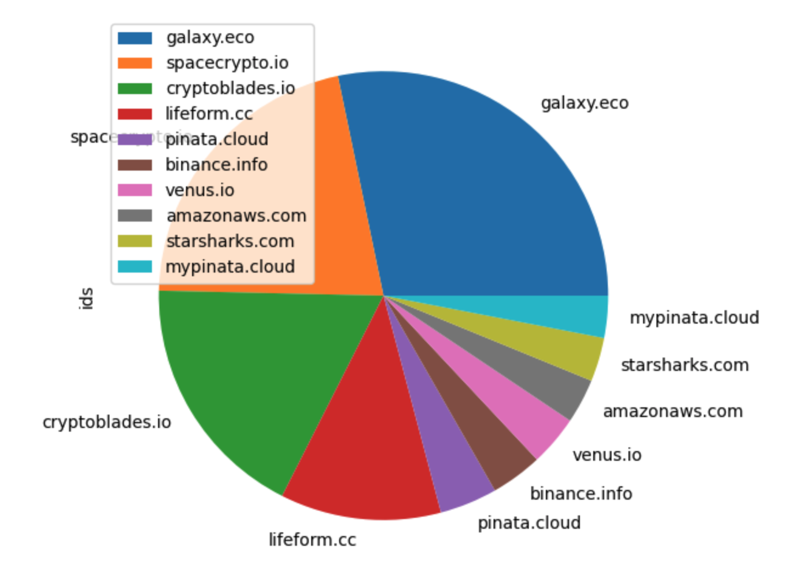

# Where NFT Data Lives

*Aleksey Studnev, Bitquery.io,
24 May, 2023*

This article shows the usage of different approaches to store and access
non-fungible tokens ( NFT ) metadata in EVM type blockchains. 
Three major protocol usage is analysed ( data, http, ipfs ) as well as most popular
domains for http protocol.

The data is taken from the Bitquery dataset and processed using Pandas tools
using Jupyter Notebook, published in the [github project](https://github.com/bitquery/nft-articles.git).

## What is NFT

Main difference of Non-fungible tokens (NFTs)  from common ("fungible") currencies is tht every 
NFT token has unique feature. Every NFT token is fifferent and so far, they can not mixed together.
"Pecunia non olet", but for NFTs this is not true.

What makes NFT unique is metadata, associated with each NFT token. Metadata is identified by ID number, 
as defined in ERC721 and ERC1155 token standards. As ID is the part of the state of smart contract,
implementing the token, it is recorded in the blockchain. NFT token ownership and transfers are defined
by this ID, and this can be proven by analysing blockchain history.

## NFT Metadata

NFT metadata, is not well standardised and can be stored on-chain or off-chain. Every NFT project 
is deciding how / where to store it. We analysed NFT on-chain data to see how metadata
is stored for NFTs in two blockchains - Ethereum and Binance Smart Chain.

While ID is the identifier of NFT token, it does not give a clue what this NFT "contains". All important
properties, like name, image, properties are defined in the metadata. Example of it is:

```json
{
  "description": "RaidParty - Hero",
  "image": "https://cdn.raid.party/hero/20.png",
  "name": "Hero #20",
  "attributes": [
    {
      "trait_type": "Body",
      "value": "tan"
    },
    {
      "trait_type": "Hat",
      "value": "Angel Halo"
    },
    {
      "trait_type": "Party Size",
      "value": 6
    },
    {
      "trait_type": "Genesis",
      "value": "True"
    }
  ]
}
```

This metadata fully describes NFT token instance for a given ID. For this particular case
it defines
* name "Hero #20"
* description "RaidParty - Hero"
* properties, e.g. "Hat": "Angel Halo"
* image:


There may be other metadata, NFT creators can extend the metadata format.

<div style="page-break-after: always"></div>

## Why Metadata Storage Important?

What we are focusing today, is not the metadata itself, but the way of it storage and access.
Most NFT token smart contract have ```tokenURI(uint256)``` or ```uri(uint256)``` methods, 
allowing to get URI for the metadata for a given ID of the token.

In some cases, NFT token and URI includes the cryptographic hash of the content of the token, which
prevents from metadata manipulations. However, the metadata existence and accessibility play important
role in NFT value. If the metadata will be lost, the hash will not allow to re-cover the missing metadata,
and the token will be virtually useless, as will loose everything except its ID.

As blockchain is decentralised and ensures persistence of NFT identification,
and security of ownership and transfers, the same can be expected from the metadata storage.
However, as we found in this analysis, it is not yet true in most cases.


## Storage Protocols

URI may use different protocols to access metadata:

* **http or https** URL: ```https://meta.gen-ii-brains.alteredstatemachine.xyz/ipfs/QmUawFgby4HLoErugb3ejgXK7WR27p6fe29NKNRUvdNi7H```
* **ipfs** URL: ```ipfs://QmUxXggfyrr4JzAo5r8nr4DJv7ZBoS96pymbv5PkDjMSQs//70.json```
* **data** URL: ```data:application/json;base64,eyJuYW1lIjo...Wx1ZSI6ICJHZW5pZSJ9XX0=```

The analysis of thousands of NFT smart contracts shown, that it actually limited to these three options,
and no other alternatives found. 


## Metadata Protocols Distribution Analysis

The distribution of usage between the protocols for Ethereum and BSC is shown below:

### Ethereum Mainnnet NFT Storage Protocols


### Binance Smart Chain Mainnnet NFT Storage Protocols


The distributions are built by 3 criteria:

* left - by number of NFT transfers using tokens with selected storage protocol
* middle - by count of unique smart contracts of tokens with protocol
* right - by unique NFT ids used with selected protocol

As you see, in both networks http/https protocols mostly prevailing, especially in BSC network.
In Ethereum mainnet, IPFS protocol has significant usage, especially in smart contract count.

Https is much more popular than http, and that makes a lot of sense, as there will be evident
issues to use http protocol in browser, especially on 3d party https web pages.

Data protocol has some niche, limited to 10-20% in both networks.

## Dynamics for Metadata Protocols Usage

By month distribution of protocols is shown below:

### Ethereum Mainnnet Dynamics by Smart Contract Count


It shows the gradual growth of ipfs usage in ethereum NFT smart contracts,
especially at 2021-2022, when NFT grown in popularity. Data protocol
usage have not grown much.

### Ethereum Mainnnet Dynamics by Transfers Count


Exept the spike in 2019, probably caused by airdrops, the same dynamics seen
as in the previous graph. This means that NFT with ipfs protocol not just 
used by NFT developers, they are well adopted by NFT traders and users.

### Binance Smart Chain Dynamics by Transfers Count


Binance smart chain shows little dynamics, with the prevailing role of http/https protocols.

## Centralised versus Decentralised

Why we put so much attention to the protocol distribution and dynamics?
Apart from technical pecularities of accessing metadata, there are important conceptual differences in them.

### HTTP / HTTPS

http/https implies deploying of some resource in Internet and typically involves
several entities involved in data storage and access:

* DNS, resolving the name ( registrar / domain owner)
* Network to access data center (s) where servers located
* Data center
* Server owner, where metadata located

All these parts are controlled by organisations and governments. They can be limited, censored or turned off
as any centralised resource.

Benefit of https usage is the wide adoption of this protocol in Internet and support
from all browsers. It make it easy to integrate NFTs on Web pages and applications.

Note, that NFT project may have many ways of storing NFT metadata. It may store 
data in IPFS and have alternative ways of access by HTTP.

### Interplanetary File System ( IPFS )

IPFS is the decentralised storage, meaning that the data is replicated among multiple
nodes, residing on multiple continents and network segments.

In theory, IPFS ensures high availability and no dependencies that http aparently has.
Practice however is more difficult, the files are not totally guranteed to be stored,
and the availabiltiy sometimes not as good as should be. 

Another downside is a low adoption from the client/browsers outside web3 community,
that complicate intergation in web pages and apps and require gateways to access ipfs files.
It comes back to the same problem with the gateway as with http protocol.

### Data embedding ( data / base64 )

This protocol directly embeds the data **inside** URI. Effectively it means that the data completely
stored on-chain ( as a part of smart contract or smart contract state, or both ). There is no external
server needed. This is an ideal example of URI, as URL is not required.

This protocol  is the most decentralised ( as the blockchain it is running at ).

### Where is BitTorrent and Others?

Initially, there was an expectation to see some other protocols
( as magnet links, s3 or torrent ), but none of them are found in somehow
notable usage in NFTs.

BitTorrent has much wider adoption and usage compared to IPFS.
Magnet links could be a good alternative for NFT URIs, and it is rather strange it
they are not used.


# HTTP Domains in Use

Domains used in http/https protocols actually define who is the "owner" of NFT metadata.
We analysed all NFT transactions to figure out the most popular domains:

##  Domains in Ethereum Mainnet


##  Domains in BSC Mainnet



This distribution is build by number of uniaue NFT IDs in use, as
we consider the "size" of the NFT storage for the domain.

Interesting to see that there is almost no intersection in them,
meaning that NFT projects mostly bound to a specific network and actually very dependent on it.

To see it closer we build the word cloud ( the bigger teh word, the more popular the domain):

##  Domain Word Cloud in Ethereum Mainnet


##  Domain Word Cloud in BSC Mainnet


There are some domains used in both networks, notably **pinata.cloud**

<div style='page-break-after: always; width: 100%'> </div>


##  Conclusion

We analysed on-chain data for NFT storage statistics on Ethereum and BSC networks.
All data and graphs are available in [github project](https://github.com/bitquery/nft-articles.git).

The conclusion we made are:

* All NFT metadata stored in 3 methods - embedded onchain ( data ), IPFS and HTTP/HTTPS;
* HTTPS is the most popular in both networks, with IPFS growing in popularity in Ethereum Network;
* Domains used are many and different in these networks, with the little intersection between them;


